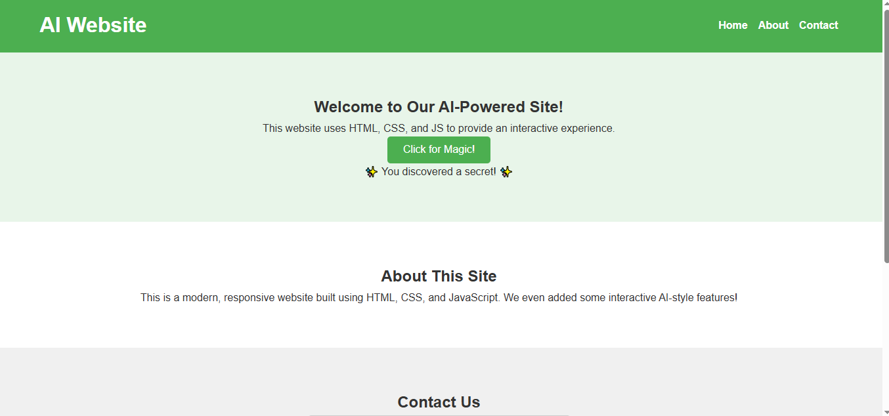

# MY_First_WEBSITE
A modern, responsive website built with HTML, CSS, and JavaScript featuring interactive AI-style elements.
# AI-Powered Website

A modern, responsive website built using **HTML, CSS, and JavaScript**, featuring interactive AI-style elements. Perfect for learning web development and exploring small interactive features.

---

## Table of Contents

- [Features](#features)  
- [Demo](#demo)  
- [Technologies](#technologies)  
- [Installation](#installation)  
- [Usage](#usage)  
- [File Structure](#file-structure)  
- [How to Contribute](#how-to-contribute)  
- [Future Features](#future-features)  
- [Contact](#contact)  
- [License](#license)  

---

## Features

- ✅ **Responsive design** for mobile and desktop  
- ✨ **Interactive "Magic Button"** that displays random AI-style messages  
- 📨 **Contact form** with instant submission feedback  
- 🎨 **Clean, modern design** with smooth scrolling  
- ⚡ **Easy customization** via HTML, CSS, and JS  

---

## Demo

You can view a live demo of the website here:  
[Live Demo](https://khairbakshnoor-pixel.github.io/MY-WEBSITE/)

**Screenshot Preview:**  
 

---

## Technologies

This project is built with:

- **HTML5** – Structure of the website  
- **CSS3** – Styling and responsive design  
- **JavaScript (ES6)** – Interactivity and dynamic elements  
- Optional: **Google Fonts / Icons** – For extra styling  

🚀 This repository is a hands-on collection of HTML & CSS concepts, built to strengthen front-end fundamentals using modern layout techniques like Flexbox, CSS Grid, and Animations.

📁 Project Structure
📦 html-css-practice
 ┣ 📄 index.html
 ┣ 📄 flexbox.html
 ┣ 📄 grid.html
 ┣ 📄 animation.html
 ┣ 📁 css
 ┃ ┗ 📄 style.css
 ┗ 📄 README.md

✨ Features Covered
📐 Flexbox Layout

📄 flexbox.html

One-dimensional layouts (row & column)

Alignment & spacing

Flexible and responsive UI components

Best for navbars, cards, and sections

🧩 CSS Grid Layout

📄 grid.html

Two-dimensional layouts (rows + columns)

Page and section structuring

Responsive grid designs

Ideal for dashboards & galleries

🎞️ CSS Animations

📄 animation.html

@keyframes animations

Hover & transition effects

Smooth motion for UI elements

Improved user interaction & visuals

🚀 What You’ll Learn

✅ Clean & semantic HTML5

✅ Modern CSS3 layout techniques

✅ Responsive web design basics

✅ Animation & transition effects

✅ Real-world front-end structure

🛠️ Technologies Used

HTML5

CSS3

Flexbox

Grid

Animations & Transitions

🎯 Purpose of This Repository

This project is created for:

📘 Learning & practice

💼 Portfolio showcase

🧪 Experimenting with layouts

🧠 Strengthening front-end basics

🌱 Future Improvements

📱 Media queries for full responsiveness

🎨 Better UI styling

⚡ JavaScript interactions

🧩 Mini projects using layouts

🤝 Contributing

Feel free to:

Fork the repository

Add improvements

Suggest better layouts

Open a pull request 🚀

👤 Author

Khair Bakhsh Noor
💻 Front-End Learner | 🚀 Aspiring Developer

⭐ If you like this repository, don’t forget to star it! ⭐